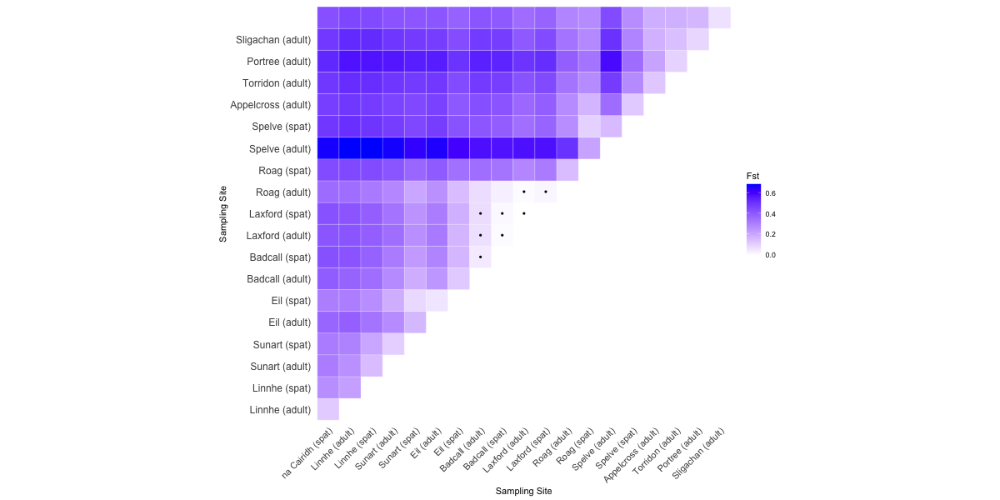
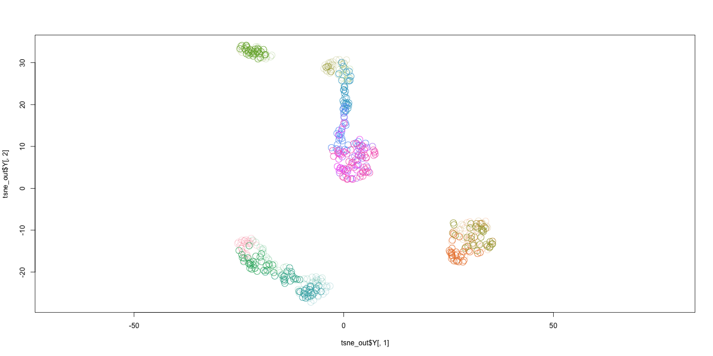
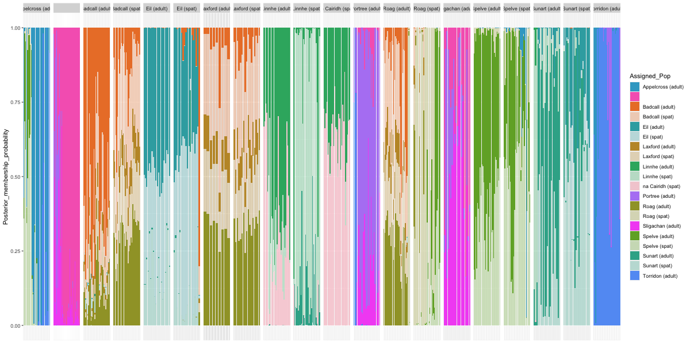

# Population Connectivity

### R Dependancies

* vcfR v1.13.0
* Rtsne v0.16
* adegenet v2.1.8
* dartR v2.7.2
* tidyverse v1.3.2
* reshape2 v1.4.4

```r
# Install packages if needed

#install.packages("vcfR");
#install.packages("Rtsne");
#install.packages("adegenet");
#install.packages("dartR");
#install.packages("tidyverse");
#install.packages("reshape2");
```

### Load packages

```r
# Load packages

library(vcfR);
library(Rtsne);
library(adegenet);
library(dartR);
library(tidyverse);
library(reshape2);
```

```r
# For reproductivity and visualisation in Jupyter

set.seed(0);
setwd(".");
options(repr.plot.width=16, repr.plot.height=8);
```

### Read data


```r
# Load genotypes fon VCF file

gt.vcf <- read.vcfR("mussels.snps.vcf.gz");
gt.vcf;
```

```plaintext
Scanning file to determine attributes.
File attributes:
  meta lines: 380
  header_line: 381
  variant count: 552
  column count: 529
Meta line 380 read in.
All meta lines processed.
gt matrix initialized.
Character matrix gt created.
  Character matrix gt rows: 552
  Character matrix gt cols: 529
  skip: 0
  nrows: 552
  row_num: 0
Processed variant: 552
All variants processed


***** Object of Class vcfR *****
520 samples
378 CHROMs
552 variants
Object size: 2.4 Mb
40.6 percent missing data
*****        *****         *****
```

```r
# Load metadata

population <- read.delim("data/species.pop.tsv", header=FALSE, sep="\t", col.names=c("sample", "group", "colour", "loch", "age", "id" , "larvaeYear"));
head(population);
```

~ | sample | group | colour | loch | age | id | larvaeYear
:---:|:---|:---:|:---|:---:|:---:|:---:|:---:
1 | 1-1 | 1 | #F771894B | Skye | spat | na Cairidh (spat) | 2021
2 | 1-10 | 1 | #F771894B | Skye | spat | na Cairidh (spat) | 2021
3 | 1-11 | 1 | #F771894B | Skye | spat | na Cairidh (spat) | 2021
4 | 1-12 | 1 | #F771894B | Skye | spat | na Cairidh (spat) | 2021
5 | 1-13 | 1 | #F771894B | Skye | spat | na Cairidh (spat) | 2021
6 | 1-14 | 1 | #F771894B | Skye | spat | na Cairidh (spat) | 2021


## Fst

```r
gl.mussel <- vcfR2genlight(gt.vcf);
pop(gl.mussel) <- population$id;
```

```r
# Calculate Fst
gl.ft <- gl.fst.pop(gl.mussel, nboots = 1000, percent = 99, nclusters = 1, verbose = NULL);
gl.ft$Fsts;
```

```r
melted <- melt(gl.ft$Fsts, na.rm =TRUE);
melted_p <- melt(gl.ft$Pvalues, na.rm =TRUE);
melted <- cbind(melted, melted_p);
melted <- melted[c(1,2,3,6)];
melted$value.1 <- ifelse(melted$value.1>0.001,1,0);

ggplot(data = melted, aes(Var2, Var1, fill = value)) + theme_classic() + geom_tile(color = "white") + scale_fill_gradient(low = "white", high = "blue", name="Fst") + geom_point(aes(alpha=value.1) ,colour="black", stroke=NA) + scale_alpha_continuous(range=c(0, 1), guide="none") + labs( x = "Sampling Site", y = "Sampling Site") + theme(axis.text.x = element_text(angle = 45, vjust = 1, size = 11, hjust = 1), axis.text.y = element_text(size = 12), axis.ticks=element_blank(), axis.line=element_blank()) +  coord_fixed();
```




```r
# For publication only

#png("Figure_Fst.raw.png", 600, 300);
#ggplot(data = melted, aes(Var2, Var1, fill = value)) + theme_classic() + geom_tile(color = "white") + scale_fill_gradient(low = "white", high = "blue", name="Fst") + geom_point(aes(alpha=value.1) ,colour="black", stroke=NA) + scale_alpha_continuous(range=c(0, 1), guide="none") + labs( x = "Sampling Site", y = "Sampling Site") + theme(axis.text.x = element_text(angle = 45, vjust = 1, size = 11, hjust = 1), axis.text.y = element_text(size = 12), axis.ticks=element_blank(), axis.line=element_blank()) +  coord_fixed();
#dev.off();
```

## t-SNE analysis

```r
# Convert to matrix of genotypes

gt <- as.data.frame(t(extract.gt(gt.vcf, element = 'GT', as.numeric = FALSE)));
gt[gt == '0|0'] <- 0
gt[gt == '1|1'] <- 2
gt[gt == '0|1'] <- 1
gt[gt == '1|0'] <- 1
gt[is.na(gt)] <- 1; # replace NA by 1 (heterozygous)

gt[] <- lapply(gt, function(x) as.numeric(as.character(x)))
gt <- as.matrix(gt);

head(gt);
```

~ | V1 | V2 | V3 | V4 | V5 | V6 | V7 | ... | V546 | V547 | V548 | V549 | V550 | V551 | V552
:---:| :---:|:---:|:---:|:---:|:---:|:---:|:---:|:---:|:---:|:---:|:---:|:---:|:---:|:---:|:---:
1-1 | 1 | 2 | 0 | 1 | 1 | 1 | 1 | ... | 0 | 0 | 0 | 0 | 2 | 0 | 0
1-10 | 1 | 2 | 0 | 1 | 1 | 1 | 1 | ... | 0 | 0 | 0 | 0 | 2 | 0 | 0
1-11 | 1 | 2 | 0 | 1 | 1 | 1 | 1 | ... | 1 | 0 | 0 | 0 | 1 | 0 | 0
1-12 | 1 | 2 | 0 | 1 | 1 | 1 | 1 | ... | 0 | 0 | 0 | 0 | 2 | 0 | 0
1-13 | 1 | 2 | 0 | 1 | 1 | 1 | 1 | ... | 0 | 0 | 0 | 0 | 2 | 0 | 0
1-14 | 1 | 2 | 0 | 1 | 1 | 1 | 1 | ... | 0 | 0 | 0 | 0 | 2 | 0 | 0

```r
# Run un-optimised t-SNE

tsne_out <- Rtsne(gt, initial_dims = 2, perplexity = 20, theta = 0.5, max_iter = 1000);
```

```r
plot(tsne_out$Y[, 1], tsne_out$Y[, 2], col=population$colour, cex=2, asp=1);
```
    

    
```r
# For publication only

#png("Figure_tSNE.raw.png", 600, 300);
#plot(tsne_out$Y[, 1], tsne_out$Y[, 2], col=population$colour, cex=2, asp=1);
#dev.off();
```

## Posterior membership probability (not used)

```r
# Convert to a genlight object

gl.mussel <- vcfR2genlight(gt.vcf);
ploidy(gl.mussel) <- 2;
pop(gl.mussel) <- population$id;

gl.mussel;
```

```plaintext
/// GENLIGHT OBJECT /////////

// 520 genotypes,  552 binary SNPs, size: 1.4 Mb
116547 (40.6 %) missing data

// Basic content
  @gen: list of 520 SNPbin
  @ploidy: ploidy of each individual  (range: 2-2)

// Optional content
  @ind.names:  520 individual labels
  @loc.names:  552 locus labels
  @chromosome: factor storing chromosomes of the SNPs
  @position: integer storing positions of the SNPs
  @pop: population of each individual (group size range: 9-46)
  @other: a list containing: elements without names 
```

```r
# DAPC posterior probality assignment

gl.dapc <- dapc(gl.mussel, n.pca = 5, n.da = 2);
```

```r
# Prepare resulting matrix

dapc.results <- as.data.frame(gl.dapc$posterior);
dapc.results$pop <- pop(gl.mussel);
dapc.results$indNames <- rownames(dapc.results);

dapc.results <- pivot_longer(dapc.results, -c(pop, indNames));

dapc.results$colour <- population$colour[match(dapc.results$name, population$id)];
colnames(dapc.results) <- c("Original_Pop", "Sample", "Assigned_Pop", "Posterior_membership_probability", "Colour");
head(dapc.results);

col <- matrix(dapc.results$Colour);
rownames(col) <- dapc.results$Assigned_Pop;
```

Original_Pop | Sample | Assigned_Pop | Posterior_membership_probability | Colour
:---|:---:|:---|:---:|:---
na Cairidh (spat) | 1-1 | Appelcross (adult) | 8.626999e-111 | #39A8CC
na Cairidh (spat) | 1-1 | Bàgh a Tuath (adult) | 2.580021e-119 | #F668BE
na Cairidh (spat) | 1-1 | Badcall (adult) |  2.200015e-39 | #EB8032
na Cairidh (spat) | 1-1 | Badcall (spat) |  5.374162e-48 | #EB80324B
na Cairidh (spat) | 1-1 | Eil (adult) |  5.171827e-20 | #36ABB0
na Cairidh (spat) | 1-1 | Eil (spat) |  2.653929e-23 | #36ABB04B


```r
p <- ggplot(dapc.results, aes(x=Sample, y=Posterior_membership_probability, fill=Assigned_Pop));
p <- p + geom_bar(stat="identity");
p <- p + scale_fill_manual(values=col);
p <- p + facet_grid(~Original_Pop, scales = "free");
p <- p + theme(axis.title.x=element_blank(), axis.text.x=element_blank(), axis.ticks.x=element_blank());
p;
```
    


```r
# For publication only

#png("Figure_DAPC.raw.png", 600, 300);
#p;
#dev.off();
```
