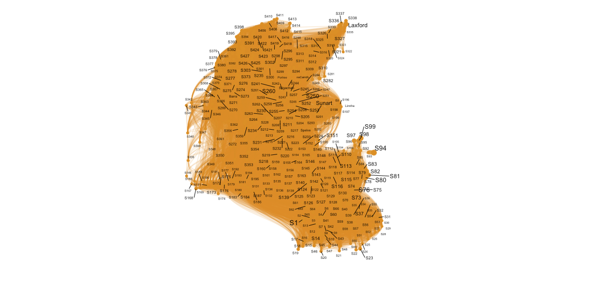
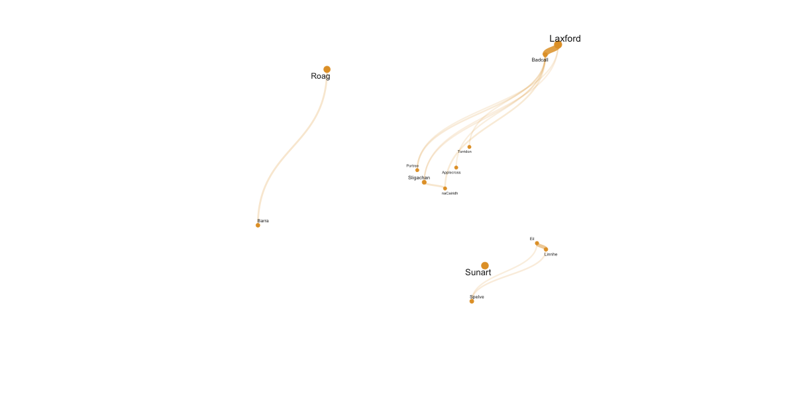

# Model connectivity

### R Dependancies

* tidygraph v1.2.2
* igraph v1.3.4
* ggraph v2.1.0
* ggrepel v0.9.2
* terra v1.6-47
* tidyterra v0.3.1

```r
install.packages("terra");
install.packages("tidyterra");
install.packages("tidygraph");
install.packages("igraph");
install.packages("ggraph");
install.packages("ggrepel");
```

### Load packages

```r
library(terra);
library(tidyterra);
library(tidygraph);
library(igraph);
library(ggraph);
library(ggrepel);
```

```r
# For reproductivity and visualisation in Jupyter

set.seed(0);
setwd(".");
options(repr.plot.width=16, repr.plot.height=8);
```

### Read data (e.g. April 5th to May 8th 2021)

```r
# Load UK Map
fn <- file.path(tempdir(), "gadm41_GBR_shp.zip", fsep = "\\")
download.file("https://geodata.ucdavis.edu/gadm/gadm4.1/shp/gadm41_GBR_shp.zip", fn)
utils::unzip(fn, exdir = tempdir())
shp <- vect(file.path(tempdir(), "gadm41_GBR_1.shp"))
```

```r
# Load the sources/target locations
nodes <- as.data.frame(read.delim("data/allpoints.dat", header=FALSE, col.names=c("Name", "Longitude", "Latitude"), sep="\t"));
nodes_selected <- as.data.frame(read.delim("data/samplepoints.dat", header=FALSE, col.names=c("Name", "Date", "Longitude", "Latitude"), sep="\t"));


# Load the connectivity_*.dat files for the last 7 days of the simulation and add the matrixes
files <- file.path(path=".", c('connectivity_20210502_648.dat', 'connectivity_20210503_672.dat', 'connectivity_20210504_696.dat', 'connectivity_20210505_720.dat', 'connectivity_20210506_744.dat', 'connectivity_20210507_768.dat', 'connectivity_20210508_792.dat'));

edges <- NA
for (file in files) {
  edges0 <- as.matrix(read.table(file, sep=" "));
  if (!is.matrix(edges)) {
    edges <- edges0;
  } else {
    edges <- edges + edges0;
  }
}
nodes$Total <- 0
# received larvae
for (i in 1:ncol(edges)) { nodes$Total[match(colnames(edges)[i], nodes$Name)] <- sum(edges[,i],na.rm=TRUE); }
# contributea larvae
#for (i in 1:nrow(edges)) { nodes$Total[match(rownames(edges)[i], nodes$Name)] <- sum(edges[i,],na.rm=TRUE); }

colnames(edges) <- nodes$Name;
row.names(edges) <- nodes$Name;

g <- graph.adjacency(edges, weighted=TRUE);
```

All connections

```r
edges_list <- get.data.frame(g);
edges_list <- edges_list[which(edges_list$from %in% nodes$Name & edges_list$to %in% nodes$Name),];
nodes_list <- nodes[which(nodes$Name %in% edges_list$to | nodes$Name %in% edges_list$from),];
```

```r
for (i in 1:nrow(edges_list)) { edges_list$ratio[i]<-edges_list$weight[i]/nodes$Total[which(nodes$Name == edges_list$to[i])];}
particles_graph <- tbl_graph(nodes_list, edges_list, node_key= "Name");
particle_coord_layout <- create_layout(graph = particles_graph, layout = "manual", x = nodes_list$Longitude, y = nodes_list$Latitude);
```

```r
# Plot the network on the map
ggnetwork <- ggraph(particle_coord_layout, aes(x, y, label = Name)) +
     #geom_sf(data = shp, fill = "grey95", colour = "grey85", show.legend = TRUE) +
     geom_edge_diagonal(aes(alpha = weight, width = weight), colour = "#E3A031") +
     geom_point(aes(x, y, size = Total), colour="#E3A031") +
     geom_text_repel(aes(x, y, size = Total, label = Name), alpha= .9) +
     scale_edge_width_continuous(range = c(1, 4)) +
     scale_edge_alpha(range = c(0.15, 0.85)) +
     scale_size(range = c(2, 5)) +
     coord_sf(xlim = c(-8, -4), ylim = c(53.4, 58.6)) +
     theme_void() + theme(legend.position = "none");
ggnetwork;
```



```r
# For publication only

#png("Figure_Model_ALL.raw.png", 600, 300);
#ggnetwork;
#dev.off();
```

### Select informative locations/nodes only

```r
edges_list <- get.data.frame(g);
edges_list <- edges_list[which(edges_list$from %in% nodes_selected$Name & edges_list$to %in% nodes_selected$Name),];
nodes_list <- nodes[which(nodes$Name %in% edges_list$to | nodes$Name %in% edges_list$from),];
```

### Plot the netwotk

```r
particles_graph <- tbl_graph(nodes_list, edges_list, node_key= "Name");
particle_coord_layout <- create_layout(graph = particles_graph, layout = "manual", x = nodes_list$Longitude, y = nodes_list$Latitude);

# Plot the network on the map
ggnetwork <- ggraph(particle_coord_layout, aes(x, y, label = Name)) +
     #geom_sf(data = shp, fill = "grey95", colour = "grey85", show.legend = TRUE) +
     geom_edge_diagonal(aes(alpha = weight, width = weight), colour = "#E3A031") +
     geom_point(aes(x, y, size = Total), colour="#E3A031") +
     geom_text_repel(aes(x, y, size = Total, label = Name), alpha= .9) +
     scale_edge_width_continuous(range = c(1, 4)) +
     scale_edge_alpha(range = c(0.15, 0.85)) +
     scale_size(range = c(2, 5)) +
     coord_sf(xlim = c(-7.8, -4.8), ylim = c(55.8, 58.6)) +
     theme_void() + theme(legend.position = "none");
ggnetwork;

edges_list
```
 

    
```r
# For publication only

#png("Figure_Model.raw.png", 600, 300);
#ggnetwork;
#dev.off();
```
