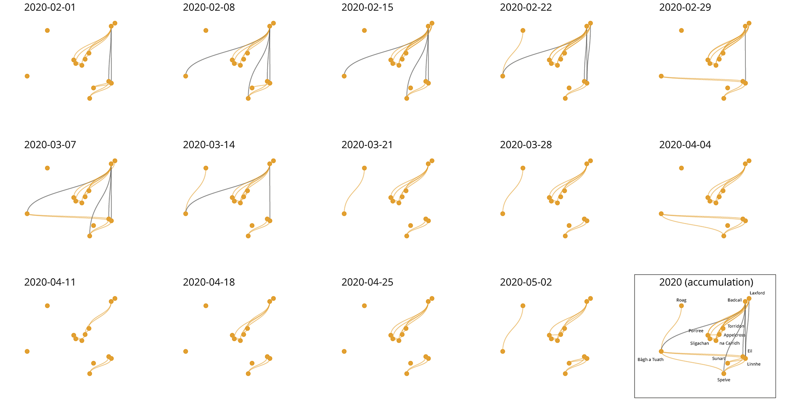
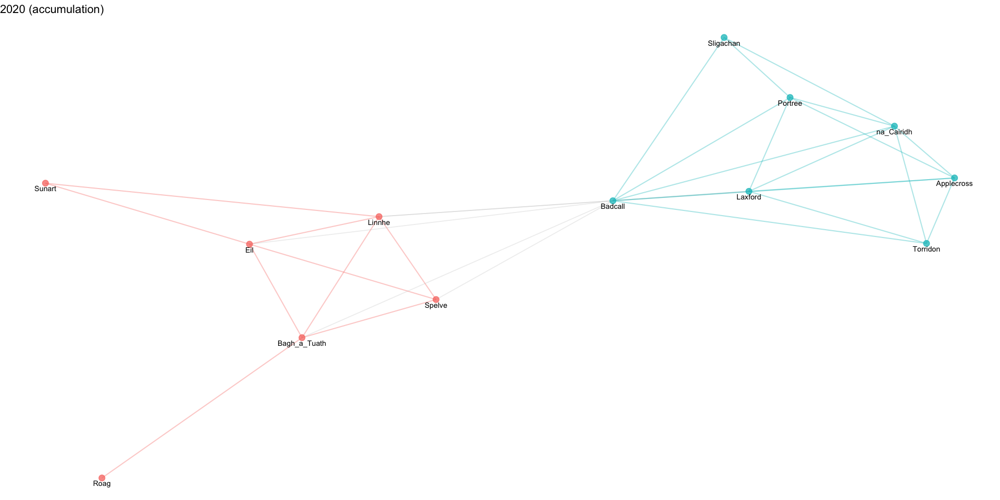
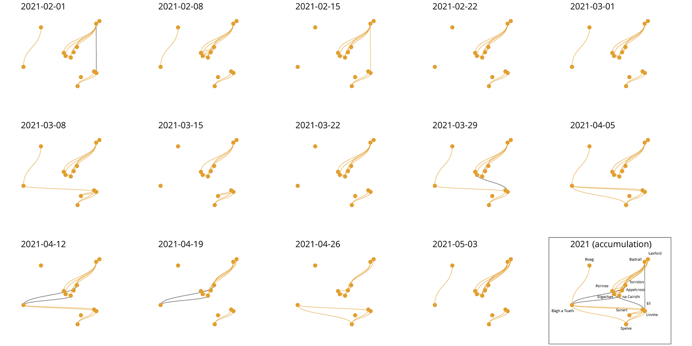
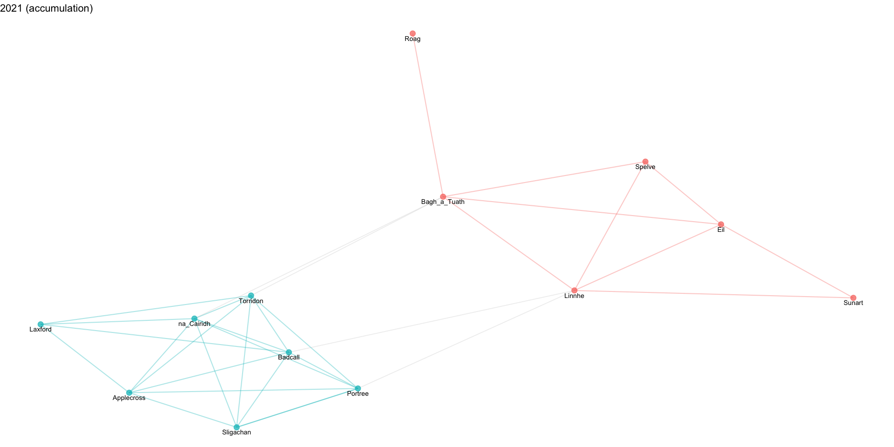

# Model connectivity

### R Dependancies

* tidygraph v1.2.2
* igraph v1.3.4
* ggraph v2.1.0
* ggrepel v0.9.2
* terra v1.6-47
* tidyterra v0.3.1
* purrr v1.0.1

```r
install.packages("terra");
install.packages("tidyterra");
install.packages("tidygraph");
install.packages("igraph");
install.packages("ggraph");
install.packages("ggrepel");
install.packages("purrr");
```

### Load packages

```r
library(terra);
library(tidyterra);
library(tidygraph);
library(igraph);
library(ggraph);
library(ggrepel);
library(purrr);
```

```r
# For reproductivity and visualisation in Jupyter

set.seed(0);
setwd(".");
options(repr.plot.width=16, repr.plot.height=8);
```

```r
# Load UK Map
fn <- file.path(tempdir(), "gadm41_GBR_shp.zip", fsep = "\\")
download.file("https://geodata.ucdavis.edu/gadm/gadm4.1/shp/gadm41_GBR_shp.zip", fn)
utils::unzip(fn, exdir = tempdir())
shp <- vect(file.path(tempdir(), "gadm41_GBR_1.shp"))
```

### Read data (2020)

```r
# Load the sources/target locations
nodes <- as.data.frame(read.delim("data/allpoints.dat", header=FALSE, col.names=c("Name", "Longitude", "Latitude"), sep="\t"));
nodes_selected <- as.data.frame(read.delim("data/samplepoints.dat", header=FALSE, col.names=c("Name", "Date", "Longitude", "Latitude"), sep="\t"));
```

#### Month per month

```r
files <- list.files(path="data/", pattern="^connectivity_2020.*\\.dat$", all.files=TRUE, full.names=TRUE);

edges <- NA;
for (file in files) {
  edges0 <- as.matrix(read.table(file, sep=" "));
  if (!is.matrix(edges)) {
    edges <- edges0;
  } else {
    edges <- edges + edges0;
  }
  
  nodes0 <- nodes;
  nodes0$Total <- 0;
  # received larvae
  for (i in 1:ncol(edges0)) { nodes0$Total[match(colnames(edges0)[i], nodes0$Name)] <- sum(edges0[,i],na.rm=TRUE); }   
  
  g <- graph.adjacency(edges0, weighted=TRUE);
  edges_list <- get.data.frame(g);
  edges_list <- edges_list[which(edges_list$from %in% nodes_selected$Name & edges_list$to %in% nodes_selected$Name),];
  nodes_list <- nodes[which(nodes0$Name %in% edges_list$to | nodes0$Name %in% edges_list$from),];

  for (i in 1:nrow(edges_list)) { edges_list$ratio[i]<-edges_list$weight[i]/nodes0$Total[which(nodes0$Name == edges_list$to[i])];}
  particles_graph <- tbl_graph(nodes_list, edges_list, node_key= "Name");
  particle_coord_layout <- create_layout(graph = particles_graph, layout = "manual", x = nodes_list$Longitude, y = nodes_list$Latitude);

  ggnetwork <- ggraph(particle_coord_layout, aes(x, y, label = Name)) +
     #geom_sf(data = shp, fill = "grey95", colour = "grey85", show.legend = TRUE) +
     geom_edge_diagonal(aes(alpha = 0.8), colour = "#E3A031") +
     geom_point(aes(x, y, size = 1), colour="#E3A031") +
     geom_text_repel(aes(x, y, label = Name), alpha= .9) +
     coord_sf(xlim = c(-8, -4), ylim = c(53.4, 58.6)) +
     theme_void() + theme(legend.position = "none") + 
     ggtitle(file);
  print(ggnetwork);
}
```



#### February to June

```r
nodes$Total <- 0;
# received larvae
for (i in 1:ncol(edges)) { nodes$Total[match(colnames(edges)[i], nodes$Name)] <- sum(edges[,i],na.rm=TRUE); }   
  
g <- graph.adjacency(edges, weighted=TRUE);
```

```r
edges_list <- get.data.frame(g);
edges_list <- edges_list[which(edges_list$from %in% nodes_selected$Name & edges_list$to %in% nodes_selected$Name),];
nodes_list <- nodes[which(nodes$Name %in% edges_list$to | nodes$Name %in% edges_list$from),];
```

```r
for (i in 1:nrow(edges_list)) { edges_list$ratio[i]<-edges_list$weight[i]/nodes$Total[which(nodes$Name == edges_list$to[i])];}
particles_graph <- tbl_graph(nodes_list, edges_list, node_key= "Name");
particle_coord_layout <- create_layout(graph = particles_graph, layout = "manual", x = nodes_list$Longitude, y = nodes_list$Latitude);
```

```r
# Plot the network on the map
ggnetwork <- ggraph(particle_coord_layout, aes(x, y, label = Name)) +
     geom_sf(data = shp, fill = "grey95", colour = "grey85", show.legend = TRUE) +
     geom_edge_diagonal(aes(alpha = 0.8), colour = "#E3A031") +
     geom_point(aes(x, y, size = 1), colour="#E3A031") +
     geom_text_repel(aes(x, y, label = Name), alpha= .9) +
     coord_sf(xlim = c(-8, -4), ylim = c(53.4, 58.6)) +
     theme_void() + theme(legend.position = "none") + 
     ggtitle("2020 (accumulation)");
ggnetwork;
```

#### Plot network analysis

```r
adj_matrix <- ifelse(edges > 0, 1, 0)

g <- graph_from_adjacency_matrix(adj_matrix);
clp <-cluster_walktrap(g);
```

```r
# Colour nodes and links according to their cluster, the rest in 'grey'
V(g)$color <- clp$membership;
a1 <- as.data.frame(get.edgelist(g));
E(g)$color <- map2_dbl(a1$V1, a1$V2, ~{ 
  ifelse(
    V(g)$color[V(g)[.x]] == 
      V(g)$color[V(g)[.y]], 
    V(g)$color[V(g)[.x]],
    9999)
}, .progress = TRUE);
```

```r
# Calculate the layout using the Fruchterman-Reingold algorithm
layout <- layout_with_fr(g);

# Create the ggraph visualization with edges, nodes, and node colors
ggnetwork2 <- ggraph(g, layout=layout) + 
  geom_edge_link0(aes(filter=color!=9999 ,color=as.factor(color)), width=0.6, alpha=0.35) +
  geom_edge_link0(aes(filter=color==9999), color='grey', width=0.5, alpha=0.25) +
  geom_node_point(aes(color=as.factor(color)), size=3, alpha=0.75) +
  geom_node_text(aes(label = name), vjust = 1.5, size = 3, color = "black") +
  theme_void() + theme(legend.position = "none") + 
  ggtitle("2020 (accumulation)");
ggnetwork2;
```
    

    

### Read data (2021)¶

```R
# Load the sources/target locations
nodes <- as.data.frame(read.delim("data/allpoints.dat", header=FALSE, col.names=c("Name", "Longitude", "Latitude"), sep="\t"));
nodes_selected <- as.data.frame(read.delim("data/samplepoints.dat", header=FALSE, col.names=c("Name", "Date", "Longitude", "Latitude"), sep="\t"));
```

#### Month per month¶

```r
files <- list.files(path="data/", pattern="^connectivity_2021.*\\.dat$", all.files=TRUE, full.names=TRUE);

edges <- NA;
for (file in files) {
  edges0 <- as.matrix(read.table(file, sep=" "));
  if (!is.matrix(edges)) {
    edges <- edges0;
  } else {
    edges <- edges + edges0;
  }
  
  nodes0 <- nodes;
  nodes0$Total <- 0;
  # received larvae
  for (i in 1:ncol(edges0)) { nodes0$Total[match(colnames(edges0)[i], nodes0$Name)] <- sum(edges0[,i],na.rm=TRUE); }   
  
  g <- graph.adjacency(edges0, weighted=TRUE);
  edges_list <- get.data.frame(g);
  edges_list <- edges_list[which(edges_list$from %in% nodes_selected$Name & edges_list$to %in% nodes_selected$Name),];
  nodes_list <- nodes[which(nodes0$Name %in% edges_list$to | nodes0$Name %in% edges_list$from),];

  for (i in 1:nrow(edges_list)) { edges_list$ratio[i]<-edges_list$weight[i]/nodes0$Total[which(nodes0$Name == edges_list$to[i])];}
  particles_graph <- tbl_graph(nodes_list, edges_list, node_key= "Name");
  particle_coord_layout <- create_layout(graph = particles_graph, layout = "manual", x = nodes_list$Longitude, y = nodes_list$Latitude);

  ggnetwork <- ggraph(particle_coord_layout, aes(x, y, label = Name)) +
     #geom_sf(data = shp, fill = "grey95", colour = "grey85", show.legend = TRUE) +
     geom_edge_diagonal(aes(alpha = 0.8), colour = "#E3A031") +
     geom_point(aes(x, y, size = 1), colour="#E3A031") +
     geom_text_repel(aes(x, y, label = Name), alpha= .9) +
     coord_sf(xlim = c(-8, -4), ylim = c(53.4, 58.6)) +
     theme_void() + theme(legend.position = "none") + 
     ggtitle(file);
  print(ggnetwork);
}
```
    


#### February to June

```r
nodes$Total <- 0;
# received larvae
for (i in 1:ncol(edges)) { nodes$Total[match(colnames(edges)[i], nodes$Name)] <- sum(edges[,i],na.rm=TRUE); }   
  
g <- graph.adjacency(edges, weighted=TRUE);
```

```r
edges_list <- get.data.frame(g);
edges_list <- edges_list[which(edges_list$from %in% nodes_selected$Name & edges_list$to %in% nodes_selected$Name),];
nodes_list <- nodes[which(nodes$Name %in% edges_list$to | nodes$Name %in% edges_list$from),];
```

```r
for (i in 1:nrow(edges_list)) { edges_list$ratio[i]<-edges_list$weight[i]/nodes$Total[which(nodes$Name == edges_list$to[i])];}
particles_graph <- tbl_graph(nodes_list, edges_list, node_key= "Name");
particle_coord_layout <- create_layout(graph = particles_graph, layout = "manual", x = nodes_list$Longitude, y = nodes_list$Latitude);
```

```r
# Plot the network on the map
ggnetwork <- ggraph(particle_coord_layout, aes(x, y, label = Name)) +
     #geom_sf(data = shp, fill = "grey95", colour = "grey85", show.legend = TRUE) +
     geom_edge_diagonal(aes(alpha = 0.8), colour = "#E3A031") +
     geom_point(aes(x, y, size = 1), colour="#E3A031") +
     geom_text_repel(aes(x, y, label = Name), alpha= .9) +
     coord_sf(xlim = c(-8, -4), ylim = c(53.4, 58.6)) +
     theme_void() + theme(legend.position = "none") + 
     ggtitle("2021 (accumulation)");
ggnetwork;
```

#### Plot network analysis

```r
adj_matrix <- ifelse(edges > 0, 1, 0)

g <- graph_from_adjacency_matrix(adj_matrix);
clp <-cluster_walktrap(g);
```

```r
# Colour nodes and links according to their cluster, the rest in 'grey'
V(g)$color <- clp$membership;
a1 <- as.data.frame(get.edgelist(g));
E(g)$color <- map2_dbl(a1$V1, a1$V2, ~ { 
  ifelse(
    V(g)$color[V(g)[.x]] == 
      V(g)$color[V(g)[.y]], 
    V(g)$color[V(g)[.x]],
    9999)
});
```

```r
# Calculate the layout using the Fruchterman-Reingold algorithm
layout <- layout_with_fr(g);

# Create the ggraph visualization with edges, nodes, and node colors
ggnetwork2 <- ggraph(g, layout=layout) + 
  geom_edge_link0(aes(filter=color!=9999 ,color=as.factor(color)), width=0.6, alpha=0.35) +
  geom_edge_link0(aes(filter=color==9999), color='grey', width=0.5, alpha=0.25) +
  geom_node_point(aes(color=as.factor(color)), size=3, alpha=0.75) +
  geom_node_text(aes(label = name), vjust = 1.5, size = 3, color = "black") +
  theme_void() + theme(legend.position = "none") + 
  ggtitle("2021 (accumulation)");
ggnetwork2;
```


